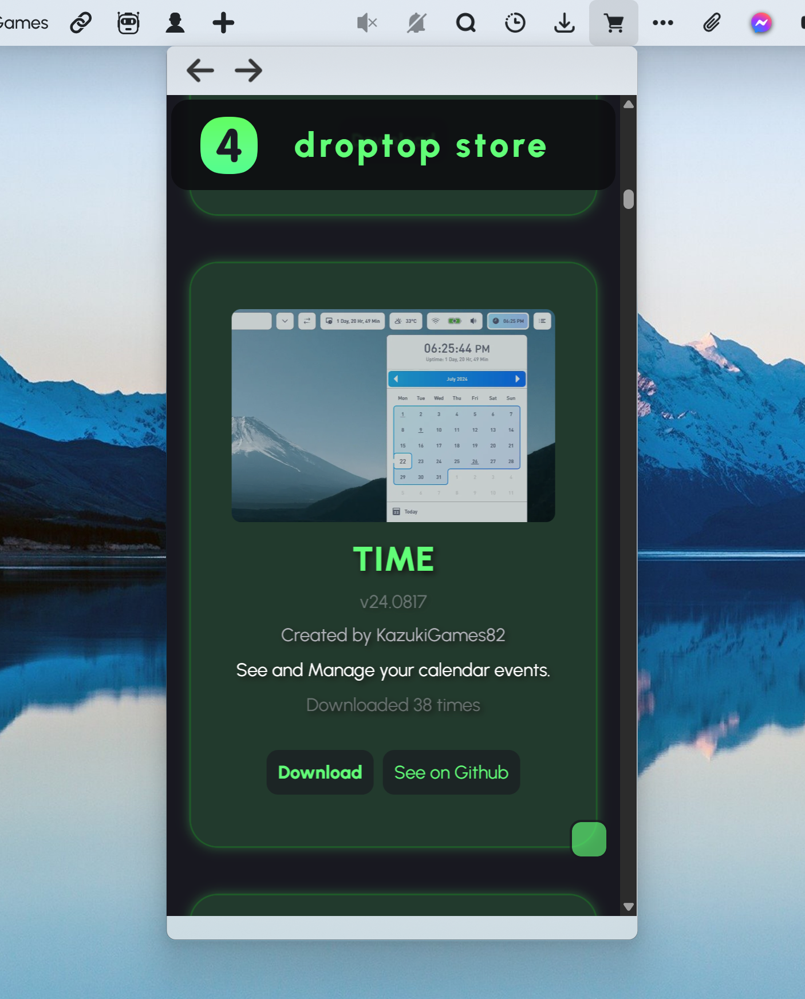

<h1 align="center">
   
  
   
  Droptop Store - Bunz
   
</h1>

<h4 align="center">Find all Community Apps and Themes from Droptop.</h4>

  
  
  
  

  <a href="#key-features">Key Features</a> •
  <a href="#how-to-use">How To Use</a> •
  <a href="#download">Download</a> •
  <a href="#credits">Credits</a> •
  <a href="#license">License</a>

## Key Features
Let's you display browse & download Droptop Four Community Apps & Themes directly from Droptop.

## How to use
Use the 2 icons on the right to change between the Community Apps view and the Community Themes view.

## Download
Download from [releases](https://github.com/66Bunz/DroptopFour-DroptopStore/releases) or from the [website](https://www.droptopfour.com/community-apps/?id=36)

## Credits
<a href="https://www.flaticon.com/free-icons/shopping-bag" title="shopping bag icons">Shopping bag icons created by Freepik - Flaticon</a>

## License

[GNU General Public License v3.0](LICENSE)

Feel free to modify or redistribute these Rainmeter skins as much as you want. Just:
- Link back to me somehow
- Use ths same license
